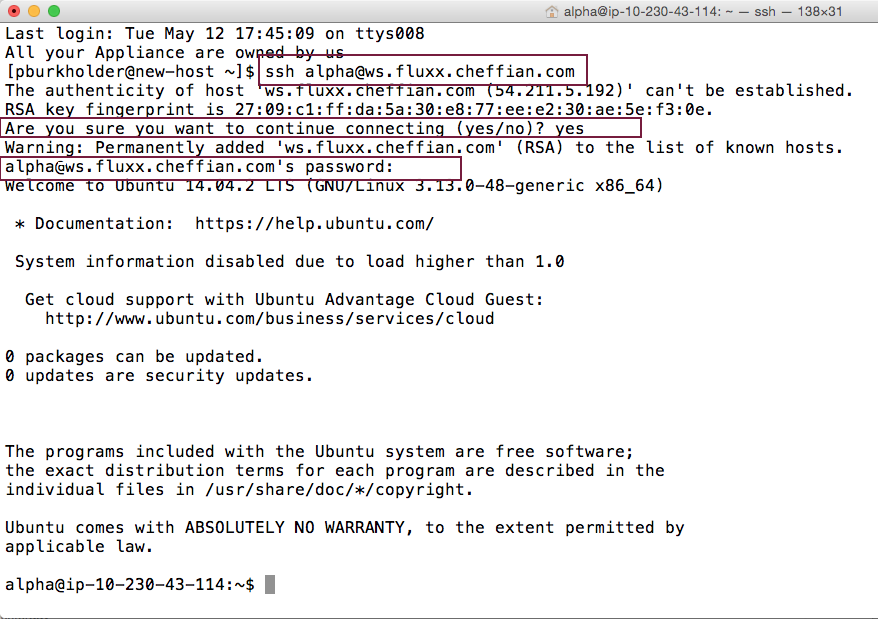
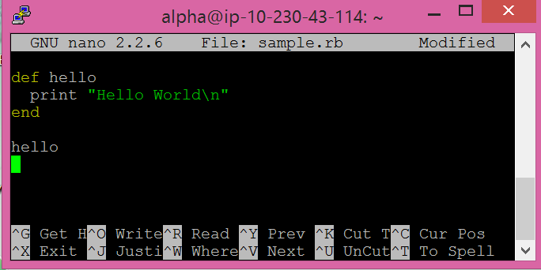

# Lab 0

### Establish Remote Working Environment

A. Use an SSH client to securely connect to remote workstation<br>
B. ~~~Use Atom and the `remote-sync` plugin to edit code on your local laptop~~~<br>
C. Verify software on your remote workstation

----

### Context

We're using a remote workstation with all packages and connectivity
preconfigured.<br>
This eliminates a lot of installation and troubleshooting on student laptops.<br>
Unless you're familiar with `vim` or `emacs`, we'll use `nano`.

----

## Your domain and password

- Where `<fluxx>` appears, use your Fluxx group name.
  - For example: `ws.milk.cheffian.com` if 'milk' is your group
- Where (your password) appears, then supply the password
  - Your instructor should have provided this

---

## A: Remote connection

----


### A.1: Mac Os X

Use the `Terminal` application to make an ssh connection your workstation:

- Open the `Terminal` app from /Applications/Utilities
- At the command prompt type: `ssh alpha@ws.<fluxx>.cheffian.com`
  - At the prompt "Are you sure you want to continue connecting?" answer: `yes`
  - For the password, enter: (your password) (it won't be displayed)
 - The login sequence should look like this:

----


Areas of user input shown in red:



----

- You should get a prompt something like, `alpha@ip-10-230-43-114:~$ `
 - Type `whoami`
 - If the result is `alpha`, continue to Section B

```bash
alpha@ip-10-230-43-114:~$ whoami
alpha
```

---


### A.2: Windows 7 or 8

----

Install `Putty` and Copy to your Desktop

----

- In your browser, go to http://www.putty.org
- Click through on the "You can download PuTTY here." link
- Click on the `putty.exe` link
  - Accept the download and 'Save' Putty.exe
  - Click 'View Downloads'
  - Right click on 'putty.exe', select 'Open containing folder'
  - **From the Downloads folder, drag 'putty.exe' to your desktop**

----

Use `Putty` to make an ssh connection your workstation:

----

- Double-click the `putty.exe` from the step above
- In the connection dialog window, fill in:
  - Host Name: `ws.<fluxx>.cheffian.com`
  - In the 'Saved Session' box, enter a name, `ws`
  - Then click `Save`
  - Then click `Open`

----


- Upon "PuTTY Security Alert" regarding uncached key:
  - Select `Yes`
- In the terminal window
  - Login as: `alpha`
  - Password for `alpha@ws.<fluxx>.cheffian.com` is (your password)


----

- You should get a prompt something like, `alpha@ip-10-230-43-114:~$ `
  - Type `whoami`
  - If the result is `alpha`, continue to Section C

```bash
alpha@ip-10-230-43-114:~$ whoami
alpha
```

---

## B: Remote editing with Atom ()

---

## C: Verify your workstation

----

### ChefDK and Git

```bash
$ git --version
git version 1.9.1
```

```bash
$ chef --version
Chef Development Kit Version: 0.5.0
chef-client version: 12.2.1
berks version: 3.2.3
kitchen version: 1.4.0
```

----

### Nano and syntax highlighting

- `nano` is a simple menu-driven text editor
  - should provide enough syntax highlighting
- open a new file, and then edit it:
```bash
nano sample.rb
```

----

- you should get highlighting
- and you should be able to save with `Ctrl-X`



---

### Ruby runs

```bash
ruby sample.rb
