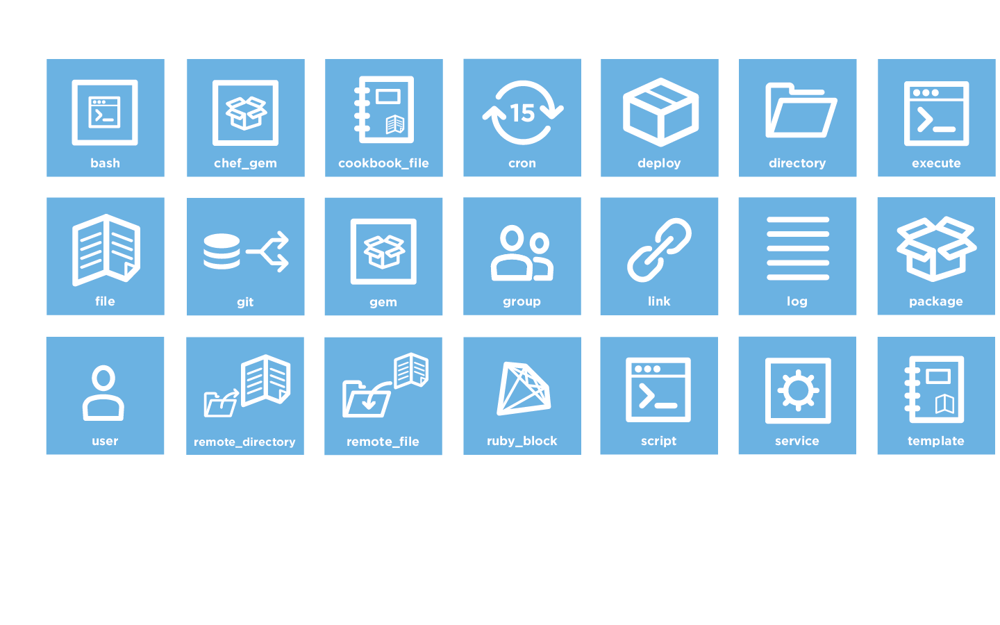

# Resources



----

# About Resources

A resource is a statement of configuration policy that:

* Describes the desired state for a configuration item
* Declares the steps needed to bring that item to the desired state
* Specifies a resource type---such as ``package``, ``template``, or ``service``
* Lists additional details (also known as attributes), as necessary
* Are grouped into recipes, which describe working configurations

----

# Objectives

* Understand resource types

----

# Resources Types

Use |chef| resources to manage a piece of the system:

* package
* template
* service
* file
* user
* machines
* registry key
* aws security groups
* aws VPCs

and more!

----

# Resource Type - package

A package to be installed:

```ruby
package "haproxy" do
  action :install
end
```

----

# Resource Type - file

A file that should be generated:

```ruby
file "/etc/motd" do
  content "Property of Chef Software, Inc."
end
```


#   Resource Type - service

A service that should be started:


```ruby
service "haproxy" do
  supports :restart => :true
  action [:enable, :start]
end
```

----

# Resource Type - aws_security_group

A security group to control network access in AWS

```ruby
with_driver 'aws::us-east-1' do
  aws_security_group 'ws.fluxx' do
    description     'ws.fluxx'
    inbound_rules   '71.178.0.0/16' => 22
  end
end
```

# Resource Type - virtual machine

A machine to be provisioned

```ruby
with_driver 'aws::us-east-1' do
  machine 'ws.fluxx' do
    action :allocate

    add_machine_options bootstrap_options: {
      instance_type: 'm1.small',
      security_groups: [ 'ws.fluxx' ]
    }
  end
end
```

---


# Resources - Syntax

A resource is a statement of configuration policy that:

* Describes the desired state for a configuration item
* Declares the steps needed to bring that item to the desired state
* Specifies a resource type---such as ``package``, ``template``, or ``service``
* Lists additional details (also known as attributes), as necessary
* Are grouped into recipes, which describe working configuraitons

----

# Objectives

    * Understand the resource syntax
    * Understand how to declare resources in recipes

----

# Syntax - Resource Type

A resource has a type:

.. code-block:: ruby

   file

----

# Syntax - Resource Name

A resource has a name:

.. code-block:: ruby

   file "hello.txt"

---

# Syntax - Resource Keywords


A resource includes details between keywords ``do`` and ``end``:

.. code-block:: ruby

   file "hello.txt" do
     ...
   end

# Syntax - Resource Action


A resource describes the state of something by declaring an action:

.. code-block:: ruby

   file "hello.txt" do
     action :create
   end


# Syntax - Resource Syntax In Plain English


The file named ``hello.txt`` should be created:

.. code-block:: ruby

   file "hello.txt" do
     action :create
   end

# Syntax - Resource Attributes


A resource includes additional details---attributes:

.. code-block:: ruby

file "hello.txt" do
 action :create
 content "Hello, world!"
 mode "0644"
 owner "chef"
 group "chef"
end

# Syntax - Resource Attributes


The TYPE named NAME should be ACTION’d with ATTRIBUTES:

.. code-block:: ruby

file "hello.txt" do
 action :create
 content "Hello, world!"
 mode "0644"
 owner "chef"
 group "chef"
end
